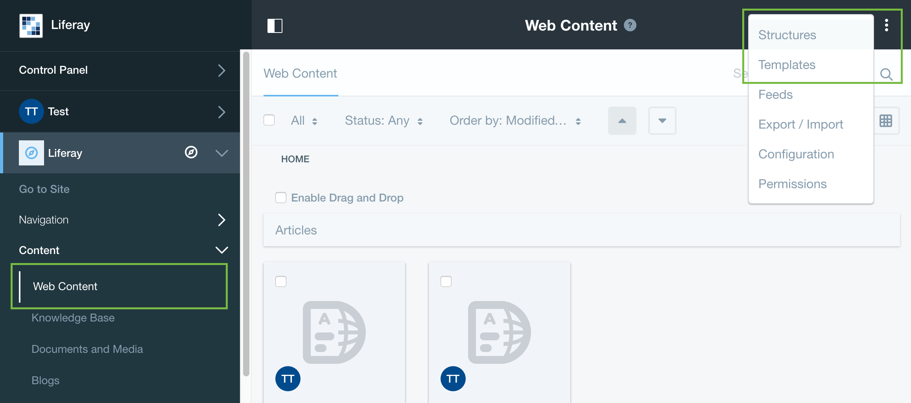

# Importing Resources

## Using Resources Importer To Deploy Themes With Predefined Content

### Key Points
 - The Resources Importer allows developers to deploy their themes, with predefined content.
 - Useful for showcasing a theme.
 - Creates a site template, which can be used for creating new sites, with a predefined look and feel.

## Resources Importer's File Structure

### Key Points
 - All theme resources reside in the `{theme-name}/docroot/WEB-INF/src/resources-importer` directory.
 - Example file structure:

    ```
    resources-importer/
        document_library/
            documents/
        journal/
            articles/
            structures/
            templates/
        assets.json
        sitemap.json
    ```

## Resources Importer Creates A Site Template

### Key Points
 - The `sitemap.json` file defines the pages of a to-be-generated site template.
 - As well as: layout templates, portlets, and portlet preferences.
 - A simple `sitemap.json` example:

    ```
    {
        "layoutTemplateId": "2_columns_ii",
        "publicPages": [
            {
                "columns": [
                    [ { "portletId": "com_liferay_login_web_portlet_LoginPortlet" } ],
                    [ { "portletId": "com_liferay_hello_world_web_portlet_HelloWorldPortlet" } ]
                ],
                "friendlyURL": "/home",
                "name": "Welcome",
                "title": "Welcome"
            }
        ]
    }
    ```

This will create one page named `Welcome` that has two columns, one with the Login portlet and the other with the Hello World portlet.

## Importing Assets with Meta-data

### Key Points
 - The `assets.json` file specifies details about the assets to be imported.
 - Tags can be applied to any asset.
 - Abstract summaries and small images can be applied to web content articles.
 - A simple `assets.json` example:

    ```
    {
        "assets": [
            {
                "name": "company_logo.png",
                "tags": [ "logo", "company" ]
            },
            {
                "abstractSummary": "This is an abstract summary.",
                "name": "My Example.xml",
                "smallImage": "company_logo.png",
                "tags": [ "web content" ]
            }
        ]
    }
    ```

## Importing Documents and Media

### Key Points
 - By default all assets, under the directory `document_library/documents/`, get imported into Portal's global Documents and Media.
 - Example file structure:

    ```
    document_library/
        documents/
            image.png
            Custom Folder
                image 2.png
    ```

With this example file structure, `image.png` will be placed in the root folder of the Documents and Media portlet. `image 2.png` will be placed in a folder named `Custom Folder`.

## Importing Web Content

### Key Points
 - The `journal` directory is used for importing various assets related to web content.
 - Such as structures (JSON), templates (Velocity/Freemarker), and web content articles (XML).
 - Example file structure:

    ```
    journal/
        articles/
            My Example Template A/ (matches template name)
                My Example Article X.xml
                My Example Article Y.xml
        structures/
            My Example Structure H.json
        templates/
            My Example Structure H/ (matches structure name)
                My Example Template A.flt
                My Example Template B.flt
    ```

This example imports a web content structure named `My Example Structure H`.

Notice that the `templates` affiliated with this structure are nested in a directory of the same name as the structure.

Similarly, `articles` that are affiliated with a template are nested in a directory of the same name as the template.

## Example Structure

### Key Points
 - Example `My Example Structure H.json`:

    ```
    {
        "availableLanguageIds": [ "en_US" ],
        "defaultLanguageId": "en_US",
        "fields": [
            { "name": "Header", "type": "text", ... },
            { "name": "Body", "type": "textarea", ... }
        ]
    }
    ```

The source JSON of web content structures can be found by clicking the `Source` tab while editing the structure.

Both structures and templates can be created/edited by navigating to the Web Content Management portlet via the product menu.



## Example Template

### Key Points
 - Example `My Example Template A.flt`:

    ```
    <h1>${Header.getData()}</h1>

    <p>${Body.getData()}
    ```

## Example Article

### Key Points
 - Example `My Example Article X.xml`:

    ```
    <?xml version="1.0"?>

    <root available-locales="en_US" default-locale="en_US">
        <dynamic-element name="Header" type="text" index-type="keyword" instance-id="mdyl">
            <dynamic-content language-id="en_US"><![CDATA[My Header]]></dynamic-content>
        </dynamic-element>
        <dynamic-element name="Body" type="text_box" index-type="keyword" instance-id="opiq">
            <dynamic-content language-id="en_US"><![CDATA[My Body]]></dynamic-content>
        </dynamic-element>
    </root>
    ```

To access the source XML of an article, navigate to the edit page of the article and click the View Source option.


## Adding Web Content To The Sitemap

### Key Points
 - Add a Web Content Display portlet to one of our pages.
 - Point it to the correct article.
 -
 - Example `sitemap.json`:

    ```
    ...
    "columns": [
        [
            { "portletId": "com_liferay_hello_world_web_portlet_HelloWorldPortlet" },
            {
                "portletId": "com_liferay_journal_content_web_portlet_JournalContentPortlet",
                "portletPreferences": {
                    "articleId": "My Example Article X.xml",
                    "groupId": "${groupId}",
                    ...
                }
            },
    ...
    ```

Here we will add the web content portlet directly below the Hello World portlet.

## Deploying Resources

### Key Points
 - Now that you have the necessary `sitemap.json` and `journal` assets, simply deploy your theme.
 - With the default configuration, the resources importer will create a site template sharing the name of your theme.


Clicking on the name of the site template will show you a preview of your, theme with the imported resources.

You can also create a new site based off the site template, which will contain all imported resources.

## Importing Resources to Existing Sites

### Key Points
 - To configure resources importer to import resources into an existing site, rather than a site template.
 - Add the following properties to: `{theme-name}/src/WEB-INF/liferay-plugin-package.properties`.

    ```
    ...
    resources-importer-target-class-name=com.liferay.portal.kernel.model.Group

    resources-importer-target-value=[site-name]
    ...
    ```

## Developer Mode

### Key Points
 - Resources Importer has a developer mode, which deletes and re-creates the target site or site template on each deploy.
 - To enable developer mode add the folloing to: `liferay-plugin-package.properties`

    ```
    ...
    resources-importer-developer-mode-enabled=true
    ...
    ```

 - Themes created via the Themes Generator have  developer mode enabled by default.
 - While this is useful for development, it should never be used in a production environment.