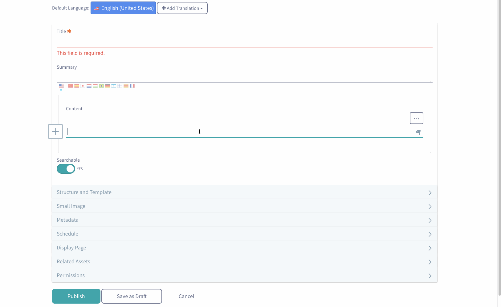

# Configuring And Customizing Allowed Content

It is possible to configure the `allowedContent` of an editor through an OSGi module. For more information about the allowed content rules, please see the documentation on [CKEditor](http://docs.ckeditor.com/#!/guide/dev_allowed_content_rules).

## Extending the Editor's Configuration
To modify the editor’s configuration, create a module that has a component that implements the `EditorConfigContributor` interface. When you implement this interface, your module will provide a service that modifies the editors you’d like to change. A simple example of this is provided below.

- Create a generic OSGi module using your favorite third party tool, or use the [Blade CLI](https://dev.liferay.com/develop/tutorials/-/knowledge_base/7-0/blade-cli).

- Create a unique package name in the module’s `src` directory, and create a new Java class in that package. The class should extend the `BaseEditorConfigContributor` class.

- Directly above the class’s declaration, insert a component annotation:

	```java
	@Component(
	    property = {

	    },

	    service = EditorConfigContributor.class
	)
	```

	For this example we're going to change the `allowedContent` of the Web Content's AlloyEditor. So the declartion would look like this

	```java
	import com.liferay.journal.constants.JournalPortletKeys;

	@Component(
		property = {
			"editor.name=alloyeditor",
			"javax.portlet.name=" + JournalPortletKeys.JOURNAL,
			"service.ranking:Integer=100"
		},
		service = EditorConfigContributor.class
	)
	public class CustomJournalMediaEditorConfigContributor
		extends BaseEditorConfigContributor {
	}
	```

- Now that you’ve specified which editor configurations you want to modify, you need to specify what about them you’d like to change. Add the following method to your new class:

	```java
	@Override
	public void populateConfigJSONObject(
	    JSONObject jsonObject, Map<String, Object> inputEditorTaglibAttributes,
	    ThemeDisplay themeDisplay,
	    RequestBackedPortletURLFactory requestBackedPortletURLFactory) {

	}
	```

- In the `populateConfigJSONObject` method, you can add the value for `allowedContent`, `extraPlugins`, `disallowedContent` through the `jsonObject` paramter:

	```java
	jsonObject.put("allowedContent", "p ");
	jsonObject.put("disallowedContent", "h1 h2 h3 h4 h5 h6 ");
	```
All together it should look like this:

```java
package com.liferay.journal.editor.configuration;

import com.liferay.journal.constants.JournalPortletKeys;
import com.liferay.portal.kernel.editor.configuration.BaseEditorConfigContributor;
import com.liferay.portal.kernel.editor.configuration.EditorConfigContributor;
import com.liferay.portal.kernel.json.JSONArray;
import com.liferay.portal.kernel.json.JSONFactoryUtil;
import com.liferay.portal.kernel.json.JSONObject;
import com.liferay.portal.kernel.portlet.RequestBackedPortletURLFactory;
import com.liferay.portal.kernel.theme.ThemeDisplay;

import java.util.Map;

import org.osgi.service.component.annotations.Component;
@Component(
	property = {
		"editor.name=alloyeditor",
		"javax.portlet.name=" + JournalPortletKeys.JOURNAL,
		"service.ranking:Integer=100"
	},
	service = EditorConfigContributor.class
)
public class CustomJournalMediaEditorConfigContributor
	extends BaseEditorConfigContributor {

	@Override
	public void populateConfigJSONObject(
		JSONObject jsonObject, Map<String, Object> inputEditorTaglibAttributes,
		ThemeDisplay themeDisplay,
		RequestBackedPortletURLFactory requestBackedPortletURLFactory) {

		jsonObject.put("allowedContent", "p ");
		jsonObject.put("disallowedContent", "h1 h2 h3 h4 h5 h6 ");
	}

}
```
Now if we create a new web content article the AlloyEditor will disallow all header tags and only for `<p>` tags

