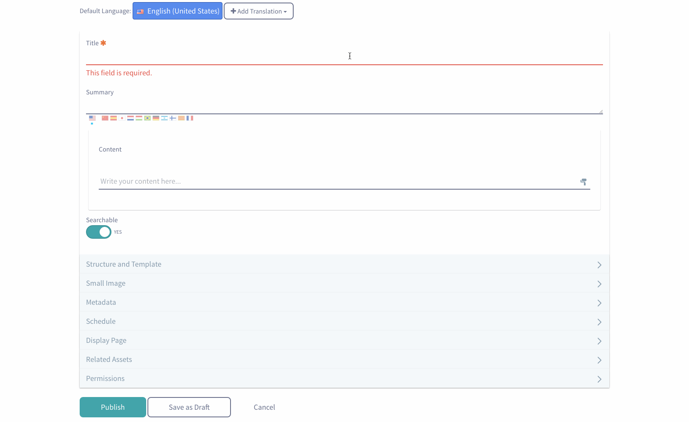

# Configuring And Customizing Toolbar Options

Liferay Portal supports many different kinds of WYSIWYG editors that can be used in portlets to edit content. Depending on the content you’re editing, you may want to modify the editor to provide a better configuration for your needs. In this tutorial, you’ll learn how to extend your Liferay supported WYSIWYG editor to add new or modify existing configurations exactly how you’d like.

## Extending the Editor's Configuration
To modify the editor’s configuration, create a module that has a component that implements the `EditorConfigContributor` interface. When you implement this interface, your module will provide a service that modifies the editors you’d like to change. A simple example of this is provided below.

- Create a generic OSGi module using your favorite third party tool, or use the [Blade CLI](https://dev.liferay.com/develop/tutorials/-/knowledge_base/7-0/blade-cli).

- Create a unique package name in the module’s `src` directory, and create a new Java class in that package. The class should extend the `BaseEditorConfigContributor` class.

- Directly above the class’s declaration, insert a component annotation:

	```java
	@Component(
	    property = {

	    },

	    service = EditorConfigContributor.class
	)
	```

	For this example we're going to add the video and camera buttons to the Web Content's AlloyEditor. So the declartion would look like this

	```java
	import com.liferay.journal.constants.JournalPortletKeys;

	@Component(
		property = {
			"editor.name=alloyeditor",
			"javax.portlet.name=" + JournalPortletKeys.JOURNAL,
			"service.ranking:Integer=100"
		},
		service = EditorConfigContributor.class
	)
	public class CustomJournalMediaEditorConfigContributor
		extends BaseEditorConfigContributor {
	}
	```

- Now that you’ve specified which editor configurations you want to modify, you need to specify what about them you’d like to change. Add the following method to your new class:

	```java
	@Override
	public void populateConfigJSONObject(
	    JSONObject jsonObject, Map<String, Object> inputEditorTaglibAttributes,
	    ThemeDisplay themeDisplay,
	    RequestBackedPortletURLFactory requestBackedPortletURLFactory) {

	}
	```


- In the `populateConfigJSONObject` method, you need to instantiate a JSONObject that holds the current configuration of the editor. For instance, you could do something like this:

 	```java
 	JSONObject toolbarsJSONObject = jsonObject.getJSONObject("toolbars");
 	```

 - Now that the `JSONObject` holds your editor’s configuration, you can modify the configuration. For instance, suppose you’d like to add a button to your editor’s toolbar. To complete this, you’d need to extract the Add buttons out of your toolbar configuration object as a JSONArray, and then add the button to that JSONArray. For example, the following code would add a Camera button to the editor’s toolbar:

 	```java
 	if (toolbarsJSONObject != null) {
 	    JSONObject addJSONObject = toolbarsJSONObject.getJSONObject("add");

 	    if (addJSONObject != null) {
 	        JSONArray buttonsJSONArray = addJSONObject.getJSONArray("buttons");

 	        buttonsJSONArray.put("camera");
 	        buttonsJSONArray.put("video");
 	    }

 	    addJSONObject.put("buttons", buttonsJSONArray);

 	    toolbarsJSONObject.put("add", addJSONObject);
 	}
 	```


All together it should look like this:

```java
package com.liferay.journal.editor.configuration;

import com.liferay.journal.constants.JournalPortletKeys;
import com.liferay.portal.kernel.editor.configuration.BaseEditorConfigContributor;
import com.liferay.portal.kernel.editor.configuration.EditorConfigContributor;
import com.liferay.portal.kernel.json.JSONArray;
import com.liferay.portal.kernel.json.JSONFactoryUtil;
import com.liferay.portal.kernel.json.JSONObject;
import com.liferay.portal.kernel.portlet.RequestBackedPortletURLFactory;
import com.liferay.portal.kernel.theme.ThemeDisplay;

import java.util.Map;

import org.osgi.service.component.annotations.Component;
@Component(
	property = {
		"editor.name=alloyeditor",
		"javax.portlet.name=" + JournalPortletKeys.JOURNAL,
		"service.ranking:Integer=100"
	},
	service = EditorConfigContributor.class
)
public class CustomJournalMediaEditorConfigContributor
	extends BaseEditorConfigContributor {

	@Override
	public void populateConfigJSONObject(
		JSONObject jsonObject, Map<String, Object> inputEditorTaglibAttributes,
		ThemeDisplay themeDisplay,
		RequestBackedPortletURLFactory requestBackedPortletURLFactory) {

		JSONObject toolbarsJSONObject = jsonObject.getJSONObject("toolbars");

		if (toolbarsJSONObject == null) {
			toolbarsJSONObject = JSONFactoryUtil.createJSONObject();
		}

		JSONObject addJSONObject = toolbarsJSONObject.getJSONObject("add");

		if (addJSONObject == null) {
			addJSONObject = JSONFactoryUtil.createJSONObject();
		}

		JSONArray buttonsJSONArray = addJSONObject.getJSONArray("buttons");

		if (buttonsJSONArray == null) {
			buttonsJSONArray = JSONFactoryUtil.createJSONArray();
		}

		buttonsJSONArray.put("video");
		buttonsJSONArray.put("audio");

		addJSONObject.put("buttons", buttonsJSONArray);

		toolbarsJSONObject.put("add", addJSONObject);

		jsonObject.put("toolbars", toolbarsJSONObject);
	}

}
```
Now if we create a new web content article the AlloyEditor will have our new options

