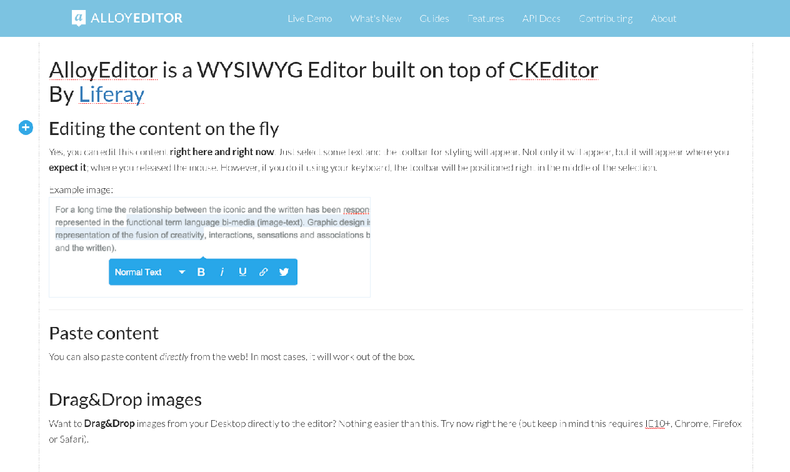

# Alloy Editor in Liferay Portal 7



## What is Alloy Editor?

It is a modern "What you see is what you get" editor built on top of the famous CKEditor, designed to create modern and gorgeous web content.

## What makes Alloy Editor different?

Editing Web Content without using iframe is not something new these days. However, the toolbar of the most editors appears on top or on bottom of the container. Wouldn't it be better to provide a modern UI, but still have all the benefits of using CKEditor?

That's where Alloy Editor comes in.  It provides a UI that provides context toolbars, which change their appearance depending on the selected element - image or text. A UI which also allows developers to add or remove buttons to these toolbars on the fly.


AlloyEditor also offers plugins that can do some really impressive things.  Such as allowing Drag&Drop of images directly in the editor. adding placeholders that work just as the standard placeholder HTML5 attribute.

## What is Alloy Editor used for?

Lots of things!  In Liferay Portal 7, you can use Alloy Editor to create web content, blog posts, announcements, and much more.  Alloy Editor is flexible and configurable enough to do any job CKEditor can, plus more!

## How do I use Alloy Editor in my portal instance?

Creating an Alloy Editor instance is as easy as including alloy editor and calling the `editable` static method like so:

```javascript
AlloyEditor.editable('myContentEditable');
```

But in portal, there is an even easier way.  You can use the Liferay UI Input Editor taglib in your JSP. It would look something like:

```jsp
<liferay-ui:input-editor contents="<%= content %>" editorName="alloyeditor" name="myAlloyEditor" placeholder="caption" showSource="<%= false %>" />
```
Notice the `editorName` attribute is set to `alloyeditor`.

## Which browsers support Alloy Editor?

AlloyEditor runs on IE9+, Chrome, Firefox and Safari.

## Who created AlloyEditor?

The project was been created by [Iliyan Peychev](https://twitter.com/ipeychev) and has been contributed to by many other brilliant developers.


<a href="https://github.com/ipeychev">
    
</a>
<a href="https://github.com/jbalsas">
    
</a><a href="https://github.com/antoniopol06">
    
</a><a href="https://github.com/ambrinchaudhary">
    
</a><a href="https://github.com/dpobel">
    
</a><a href="https://github.com/mattleff">
    
</a><a href="https://github.com/kushal">
    
</a><a href="https://github.com/Bjarno">
    
</a><a href="https://github.com/dandv">
    
</a><a href="https://github.com/dantman">
    
</a><a href="https://github.com/eduardolundgren">
    
</a><a href="https://github.com/emilecantin">
    
</a><a href="https://github.com/gerad">
    
</a><a href="https://github.com/jssisodiyaPG">
    
</a><a href="https://github.com/julianwachholz">
    
</a></div>