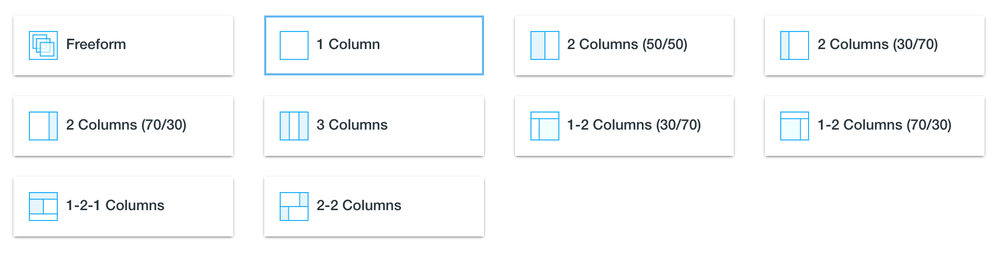

# Layout Templates

Layout Templates are used for determining the layout of a page on Liferay Portal. It defines the number of rows, and the number/width of columns that are available in each row.

These columns are then used to house portlets and content.

Liferay Portal comes bundled with a number of predefined layout templates that you can select from.

If none of the provided layout templates suit your needs, custom layout templates can be created a deployed to accomplish any combination of rows/columns.
