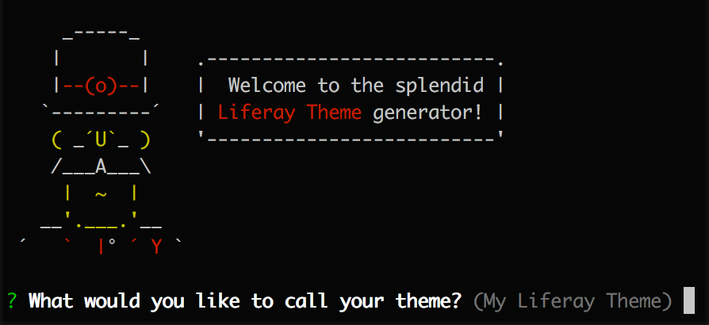
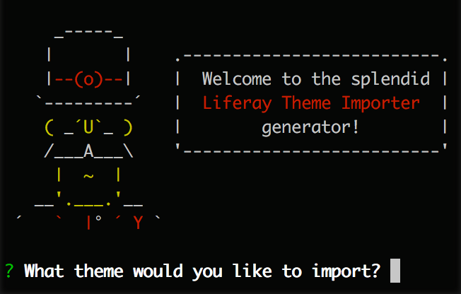
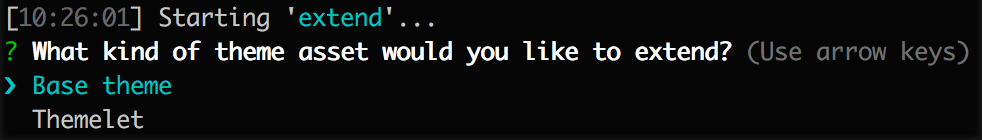
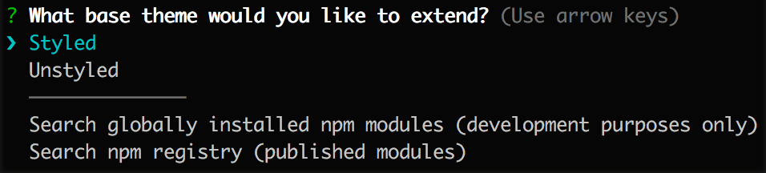

# Themes Generator

Themes were once created and deployed by using the Plugins SDK. While this method of theme development still works in 7.0, newer tools with more features have been developed to speed up the theme development process.

The two main tools available are [generator-liferay-theme](https://github.com/liferay/generator-liferay-theme) and [liferay-theme-tasks](https://github.com/liferay/liferay-theme-tasks).

- `generator-liferay-theme` is a [yeoman](http://yeoman.io/) generator that is used to create the theme boilerplate. It essentially accomplishes the same thing as the Plugins SDK's `themes/create.sh` script for creating a new theme project.
- `liferay-theme-tasks` is a set of [gulp](http://gulpjs.com/) tasks used for building and deploying your theme. These tasks are automatically installed when creating a theme with generator-liferay-theme.

## Installation

Install [Node.js](https://nodejs.org/en/) if you haven't already. The package manager `npm` is bundled with it.

Once Node.js and npm are successfully installed you can install the global npm dependencies.

```bash
[sudo] npm install -g yo gulp generator-liferay-theme
```

If the installation was successful you should have the following CLI commands available.

```
yo --version
yo --generators //should see liferay-theme listed
gulp --version
```

## Yeoman Generators

There are four generators made available by the `generator-liferay-theme` package.

- `liferay-theme`
- `liferay-theme:import`
- `liferay-theme:layout`
- `liferay-theme:themelet`

Here we will focus on `liferay-theme` and `liferay-theme:import`.

### Liferay Theme

```
yo liferay-theme
```



This command will create the base theme files and install the necessary dependencies for deployment.

It will prompt you for things such as theme name and version of Liferay Portal it's intended for, once you are done following the prompts it will create a new directory containing the theme files and install the npm dependencies.

Once the npm dependencies are installed it will prompt you for the path to your appserver. For tomcat appservers, point to the `tomcat` directory.

> Note: unlike the Plugins SDK, you can create themes anywhere on your file system.

### Liferay Theme Import

```
yo liferay-theme:import
```



This command does almost the same thing as `liferay-theme`, the difference being it pulls in source files from an existing theme in the Plugins SDK.

The only prompt will be for the root file path of the theme being imported. This generator will also create a new directory containing the theme files.

### Theme Structure

After running the `liferay-theme` or `liferay-theme:import` generator, you will find the following file structure.

File                     | Description
:----------------------- | :---------------------------------------------------------
``gulpfile.js``          | Registers tasks from `liferay-theme-tasks` to your theme
``liferay-theme.json``   | Generated file created by `gulp init` that stores appserver related configuration
``node_modules``         | Directory where npm dependencies are installed
``package.json``         | Where theme meta-data is defined and npm dependencies are declared
``src``                  | Contains source files of theme, similar to _diffs directory in Plugins SDK themes
``src/WEB-INF``          | Meta-data files such as `plugin-package.properties` and `liferay-look-and-feel.xml`

## Gulp Tasks

All gulp tasks are executed from the root directory of the theme. Here we will focus on the tasks that pertain to building and deploying your theme.

### Build

```
gulp build
```

This task compiles all source files into `build` directory and creates a WAR file in the `dist` directory of your theme.

### Deploy

```
gulp deploy
```

The `deploy` task first runs the `build` task and then deploys the generated WAR file to the specified appserver.

If your bundle is running, `deploy:gogo` can be used to deploy your theme. This method is faster than the traditional `deploy` task.

```
gulp deploy:gogo
```

### Watch

```
gulp watch
```

The `watch` task, similarly to the `deploy:gogo` task, will only work when your bundle is running, as it's communicates with Portal's Gogo shell.

It watches for changes to theme source files and will "fast deploy" so that on page refresh you're changes will take effect.

### Init

```
gulp init
```

The `init` allows you to specify your appserver path for use with the `deploy` task. It is also automatically invoked after `yo liferay-theme` and `yo liferay-theme:import`.

These properties are saved in `liferay-theme.json` which is created in your theme's root directory.

### Extend

```
gulp extend
```

The `extend` task allows you to set what base theme you would like to extend your theme from. It also let's you add themelets to your theme, which we'll get to later.



To change the base theme, select `Base Theme` in the prompt. The prompt will then let you select `Styled` or `Unstyled`. The other two options allow you to extend from other themes created by `generator-liferay-theme`.



`Styled` and `Unstyled` correspond to npm packages that have been published from `liferay-portal` source. See [liferay-frontend-theme-styled](https://www.npmjs.com/package/liferay-frontend-theme-styled) and [liferay-frontend-theme-unstyled](https://www.npmjs.com/package/liferay-frontend-theme-unstyled) npm packages.

### Status

```
gulp status
```

The `status` task simply report what base theme and themelets are implemented.
