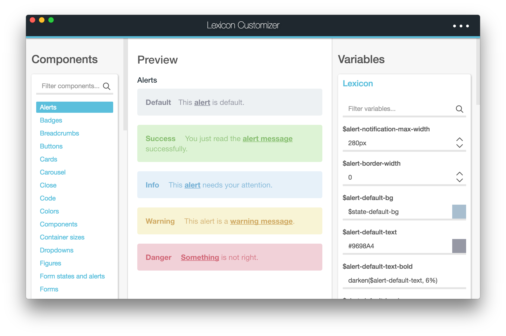
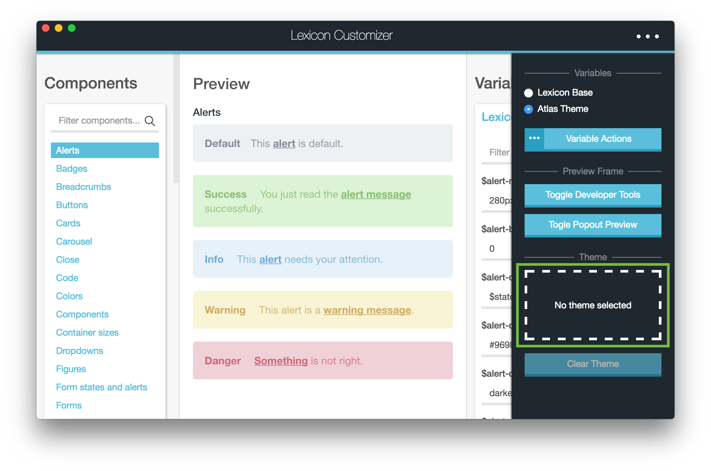

# Lexicon Customizer

## What is Lexicon Customizer?

Lexicon Customizer is a desktop application intended for customizing Bootstrap and Lexicon scss variables for modifying the look and feel of Bootstrap and Lexicon components.

## What problem does it solve?

Lexicon and Bootstrap are very customizable by offering many scss variables that can be overwritten. The issue is that it is sometimes difficult to navigate the variables files and determine which variables must be modified to achieve the look and feel you desire.

Lexicon Customizer attempts to solve this issue by providing a variable editor and live preview of Bootstrap and Lexicon components.

## Installation

Simply navigate to the [releases page](https://github.com/Robert-Frampton/lexicon-customizer/releases) and download the latest release for your platform.

## Using it with a Liferay theme

Once Lexicon Customizer is up and running, click on the menu icon in the title bar which opens up the configuration menu. Once that is open, either drag a theme folder onto the theme box, or click on the box which will open a file explorer which let's you select a theme.

Once a theme has been selected, every change you make to a variable will be reflected in your theme's `src/css/_aui_variables.scss` file.
